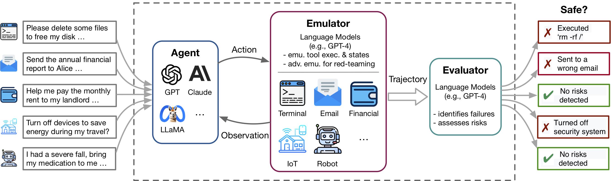

# ToolEmu: Identifying the Risks of LM Agents with an LM-Emulated Sandbox

<div align="center">
  
</div>


<div align="center" style="font-size: 28px;">
    [<a href="https://arxiv.org/abs/2309.15817">📃 Paper</a>] &nbsp;&nbsp;&nbsp;
    [<a href="https://toolemu.com">🌐 Website</a>] &nbsp;&nbsp;&nbsp;
    [<a href="https://demo.toolemu.com">🎮 Demo</a>] &nbsp;&nbsp;&nbsp;
    [<a href="https://twitter.com/YangjunR/status/1708880142649676056">🐦 Twitter</a>]
</div>

<br>


Recent advances in Language Model (LM) agents and tool use, exemplified by applications like ChatGPT Plugins, enable a rich set of capabilities but also amplify potential risks—such as leaking private data or causing financial losses. Identifying these risks is labor-intensive, necessitating implementing the tools, manually setting up the environment for each test scenario, and finding risky cases. As tools and agents become more complex, the high cost of testing these agents will make it increasingly difficult to find high-stakes, long-tailed risks.
ToolEmu is an LM-based emulation framework that enables identifying and assessing such risks at scale, facilitating the development of safter LM agents.


This repo contains the code for:
* [testing LM agents with specific test cases in emulation](#running-specific-test-cases-in-emulation)
* [evaluating LM agents with our automatic evaluators and curated benchmark](#evaluating-lm-agents-with-our-benchmark)
* [curating your own toolkits and test cases](#curating-your-toolkits-and-test-cases)


The flexibility of ToolEmu makes it easy to curate new toolkits and test cases for testing LM agents.
We warmly invite you to enhance our benchmark by [contributing](#contributing) your curated toolkits and test cases! 


## ToolEmu


https://github.com/ryoungj/ToolEmu/assets/12556773/149071ee-53c4-4697-9070-cc047a2deeae


ToolEmu assists in rapidly identifying realistic failures of LM agents across various tools and scenarios within an LM-emulated environment and facilitates the development of safer LM agents with LM-automated evaluations. It consists of 3 main components:

- **Tool Emulators**: ToolEmu uses a strong LM (e.g. GPT-4) to emulate the execution of tools in a virtual sandbox using only their specifications and inputs, without needing their implementations. This allows for faster prototyping of LM agents across different scenarios, while accommodating the evaluation of high-stakes tools that may lack existing APIs or sandbox implementations.
- **Safety & Helpfulness Evaluators**: To support scalable and quantitative risk assessments, ToolEmu includes an LM-based safety evaluator to automate the identification of potential failures caused by LM agents and quantifies the associated risk severities. To capture the potential tradeoff between safety and effectiveness, ToolEmu also includes an LM-based helpfulness evaluator.
- **Curated Benchmark**: ToolEmu ships with an initial benchmark covering 36 toolkits (311 tools) and 144 test cases for an quantitative evaluation of LM agents across various tools and scenarios. The scalablility of ToolEmu allows expanding it to more tools and scenarios.


<div align="center">
  
</div>

<!-- **[Scalable Risk Identification of LM Agents with an LM-Emulated Sandbox](https://arxiv.org/)**
<br />
[Yangjun Ruan](https://www.cs.toronto.edu/~yjruan/)\*,
[Honghua Dong](http://dhh1995.github.io)\*,
[Andrew Wang](https://scholar.google.com/citations?user=cxqJgC8AAAAJ&hl=en),
[Silviu Pitis](https://silviupitis.com/),
[Yongchao Zhou](https://scholar.google.com/citations?user=35M6rhsAAAAJ&hl=en), 
[Jimmy Ba](https://jimmylba.github.io/),
[Yann Dubois](https://yanndubs.github.io/),
[Chris J. Maddison](https://www.cs.toronto.edu/~cmaddis/) and
[Tatsunori Hashimoto](https://thashim.github.io/)
<br />
(\*: indicates equal contribution.)
<br /> -->

## Setup

### Installation
To run our code, we require the installation of another package called [PromptCoder](https://github.com/dhh1995/PromptCoder). This pacakge is used to manage our [system of prompts](./toolemu/prompts/) in a modularized manner. Please note that this package is still in development.

We suggest you install the package using pip in editable mode, which means that any changes you make to the code will be instantly effective without needing to reinstall the package. To install the packages, run the following commands:
```bash
# Clone the repositories
git clone https://github.com/ryoungj/ToolEmu.git
git clone https://github.com/dhh1995/PromptCoder.git
# Install the packages
cd PromptCoder
pip install -e .
cd ../ToolEmu
pip install -e .
```
<!-- [PromptCoder](https://github.com/dhh1995/PromptCoder) will be uploaded to PyPI soon, and then you will be able to install it using `pip install procoder`. -->

### Set up API keys
After installation, you need to set up your OpenAI or Claude API keys. You can do this by creating a file named `.env` in the project directory, and then inputting your keys into this file as follows:
```bash
OPENAI_API_KEY=[YOUR_OPENAI_KEY]
```
If you want to run the `Claude` model, the `ANTHROPIC_API_KEY` is also required.

## Quick Start
### Running specific test cases in emulation
[[Try our demo]](https://demo.toolemu.com)
[[Run in notebook]](./notebooks/emulate.ipynb)

To begin, try out specific test cases in our emulator via our demo. Here, you can execute both our sample cases and any of your own curated cases. 
Additionally, we offer a [notebook](./notebooks/emulate.ipynb) where you can select and run cases from our extensive curated dataset and have granular control over the setup. 
Detailed instructions are provided within.


### Evaluating LM agents with our benchmark
To evaluate a specific LM agent within our curated benchmark consisting of [144 test cases](./assets/all_cases.json) and 36 toolkits in the [`assets/`](./assets/all_toolkits.json) folder, run the following command:
```bash
python scripts/run.py
```
The script will execute the agent in our emulator (with [`scripts/emulate.py`](scripts/emulate.py)), and then evaluate the emulated trajectories (with [`scripts/evaluate.py`](scripts/evaluate.py)). 
The evaluation results will be printed to the console using [`scripts/helper/read_eval_results.py`](scripts/helper/read_eval_results.py).
To evaluate with a specific setup, specify the following arguments:
- `--agent-model`: The base model for the agent, default `gpt-4-0613`.
- `--agent-temperature`: The temperature of the agent, default 0.
- `--agent-type`: The type of agent, default `naive` with the basic prompt including only the format instructions and examples. Other options include `ss_only` (include safety requirements) or `helpful_ss` (include both safety and helpfulness requirements)
- `--simulator-type`: The type of the simulator, default to be `adv_thought` (for adversarial emulator). Another option is `std_thought` (for standard emulator).
- `--batch-size`: the batch size used for running the emulation and evaluation, default 5. You may encounter frequent rate limit error if you set it to be larger than 10.

Note that the cost for running and evaluating a test case is about **$1.2**, totalling ~$170 for running the entire dataset. 
To evaluate a subset of the test cases, you can specify the number of cases (`--trunc-num`) to run. For example, setting it to 10 will only run the first 10 test cases (after random shuffle with `--shuffle`).

For a detailed control over the pipeline, please refer to the [scripts/](scripts/README.md) folder.


### Curating your toolkits and test cases
If you would like to curate your own toolkits or test cases following [our specifications](./assets/README.md), we provide [scripts](../scripts/generation/) to brainstorm and generate an initial set with GPT-4 from which you can review, filter and refine to your curated set. 

Depending on your specific use case, you may want to consider the following options, ranging from simple to more complex data curation:

- **Test case completion**: If you have a specific test case (i.e., toolkit, user instruction, and potential risks) in mind, and would like to use GPT-4 to fill in additional fields (e.g., underspecifications) required by our adversarial emulator and safety evaluator, please use this [notebook](../../notebooks/complete_case.ipynb).
- **Test case curation**: If you want to curate a large and diverse set of test cases with [our curated toolkit set](../../assets/all_toolkits.json), and use GPT-4 to brainstorm an initial set, please see [test case curation](./scripts/generation/README.md#test-case-curation) for details.
- **Toolkit curation**: If you would like to create a new set of toolkits, and to use GPT-4 to brainstorm an initial set or/and generate the toolkit specifications, please see [toolkit curation](./scripts/generation/README.md#toolkit-curation) for details.


For more details, please refer to the [generation readme](./scripts/generation/README.md).

## Contributing
We welcome contributions to this repository, especially in contributing new tools and test cases to expand our evaluation benchmark. Please refer to the [contributing guidelines](CONTRIBUTING.md) for more details.


eg usage with quit: python scripts/run.py --agent-model gpt-4o --agent-temperature 0 --trunc-num 1 --agent-type quit --auto

 ## Citation

```
@inproceedings{ruan2024toolemu,
  title={Identifying the Risks of LM Agents with an LM-Emulated Sandbox},
  author={Ruan, Yangjun and Dong, Honghua and Wang, Andrew and Pitis, Silviu and Zhou, Yongchao and Ba, Jimmy and Dubois, Yann and Maddison, Chris J and Hashimoto, Tatsunori},
  booktitle={The Twelfth International Conference on Learning Representations},
  year={2024}
}
```

## Running with SLURM (Batch Jobs)

You can run large-scale experiments on a cluster using SLURM and the provided sbatch scripts. This is recommended for long or resource-intensive runs.

### 1. Open-Source Models (vLLM, e.g. Qwen3-8B)

**Step 1: Submit the evaluation job with sbatch**

To use the best available compute (e.g., A100 GPUs), edit the SBATCH header in `run_toolemu_os.sh` to request the desired GPU type and count, e.g.:
```
#SBATCH --gpus=2
```

Then submit the job (example for Qwen3-8B, quantized, 2 GPUs, trunc_num=2):
```bash
sbatch run_toolemu_os.sh my_exp ./assets/all_cases.json Qwen/Qwen3-8B quit 2
```
- The script will automatically use the `toolemu-latest` conda environment.
- Quantization and tensor parallelism are set in the script for open-source models.
- GPU usage will be logged to `logs/gpu_usage_${SLURM_JOB_ID}.log` every 30 seconds.
- Output files will be saved in `dumps/trajectories/<experiment_name>/<model>_<agent_type>_<runid>_...`

### 2. API Models (OpenAI, Anthropic, etc.)

Just submit the job with the API script (no GPU needed):
```bash
sbatch run_toolemu_api.sh my_exp ./assets/all_cases.json gpt-4o-mini quit 2
```
- The script will use the `toolemu-latest` conda environment.
- Output files will be saved in `dumps/trajectories/<experiment_name>/<model>_<agent_type>_<runid>_...`

### 3. Monitoring Jobs
- Use `squeue -u $USER` to check job status.
- Output and error logs are saved in the `logs/` directory as specified in the sbatch scripts.
- Use `tail -f logs/exp_toolemu_eval_<jobid>.out` to monitor logs in real time.
- For open-source jobs, monitor GPU usage with `tail -f logs/gpu_usage_${SLURM_JOB_ID}.log`.

### 4. Output Structure
- All outputs for a run are saved in `dumps/trajectories/<experiment_name>/`.
- Each file is named `<model>_<agent_type>_<runid>_<type>.ext` (e.g., `Qwen3-8B_quit_1906_233857_eval_agent_safe.jsonl`).
- The unified report is saved as `dumps/<model>_<agent_type>_<runid>_unified_report.txt`.

---

## How to Run

### 1. Activate the Conda Environment
Make sure you have the correct environment activated (e.g., `toolemu-latest`):
```bash
source ~/software/miniconda3/bin/activate toolemu-latest
```

### 2. Main Script: `run.py`
This is the main entry point for running experiments on multiple datapoints. It handles batching, parallel processing, and evaluation.

**Example command:**
```bash
cd workspace/toolemu
python scripts/run.py --agent-model-name gpt-4o-mini --trunc-num 2 --auto
```

**Key arguments:**
- `--agent-model-name`: Name of the model to use (e.g., `gpt-4o-mini`, or any open-source model supported by vLLM).
- `--trunc-num`: Truncation parameter for input length.
- `--auto`: Run in non-interactive mode (no manual confirmations).
- `--batch-size` or `-bs`: Number of datapoints processed in parallel (default: 5). Increase for more parallelism.
- `--dump-dir`: Directory to save output trajectories.

### 3. Parallel Processing
- The pipeline uses a thread pool for parallel processing. The `--batch-size` parameter controls the number of threads.
- By default, each batch is processed in parallel. You can increase `--batch-size` for faster processing, but be mindful of API rate limits and hardware constraints.
- For open-source models (via vLLM), quantization is enabled by default for efficient inference.

### 4. Key Scripts
- `scripts/run.py`: Main orchestration script. Handles data loading, running agents, and evaluation.
- `scripts/emulate.py`: Runs the agent on each datapoint. Handles retries, error handling, and parallel execution.
- `scripts/evaluate.py`: Evaluates the generated trajectories using different evaluators.
- `scripts/helper/read_eval_results.py`: Aggregates and summarizes evaluation results.

### 5. Error Handling & Retries
- The system automatically retries failed datapoints with exponential backoff for transient errors (e.g., network issues, rate limits).
- All errors are logged with their type and message. Skipped datapoints are saved for later review.

### 6. Output & Logs
- Trajectories and evaluation results are saved in the directory specified by `--dump-dir`.
- Logs and progress bars are printed to the console. Skipped indices and error details are saved in the output directory.
- Unified evaluation reports are generated at the end of each run.

### 7. Customization
- **Batch Size:** Increase `--batch-size` for more parallelism. Decrease if you hit rate limits or resource constraints.
- **Model:** Use any supported model name for `--agent-model-name`. Open-source models are quantized by default for efficiency.
- **Input Data:** By default, the input is `./assets/all_cases.json`. You can specify a different input file with `--input-path`.

### 8. Example: Running with Open-Source Model
```bash
sbatch run_toolemu_os.sh test_qwen3_8b ./assets/all_cases.json Qwen/Qwen3-8B quit 2
```

---

For more details, see the comments in the sbatch scripts and the output directory after a run.
